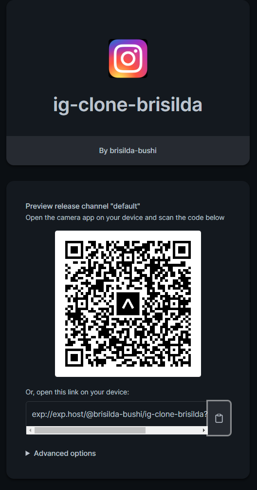
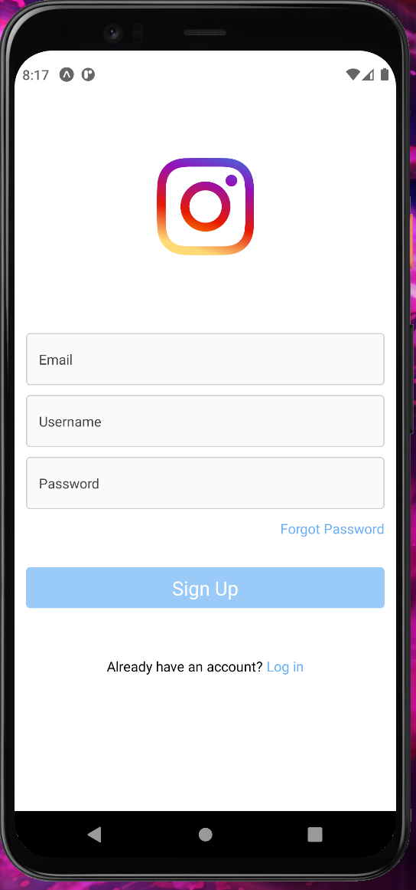
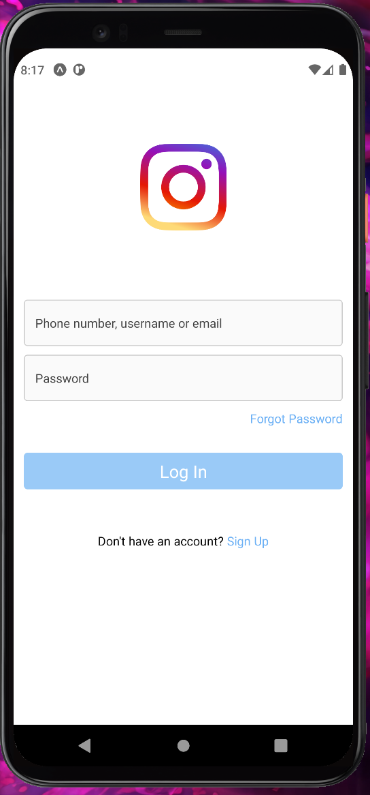
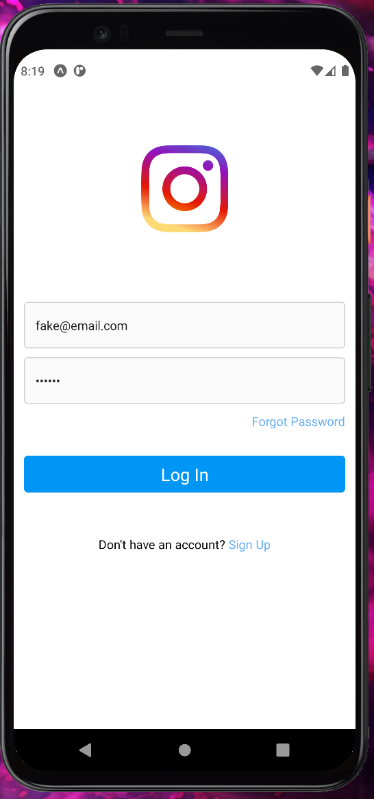
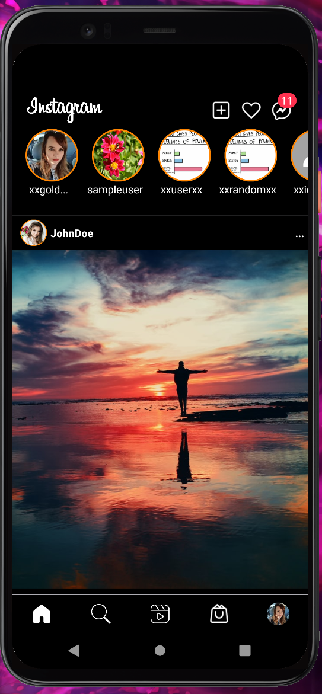
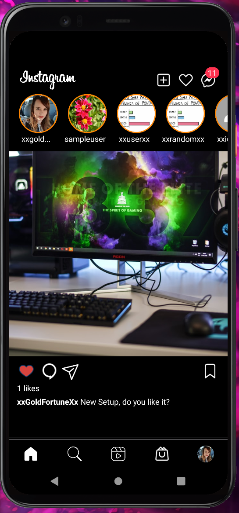
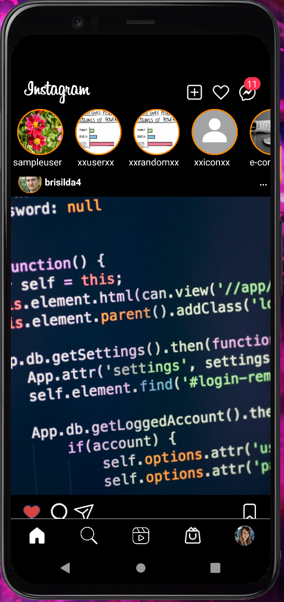
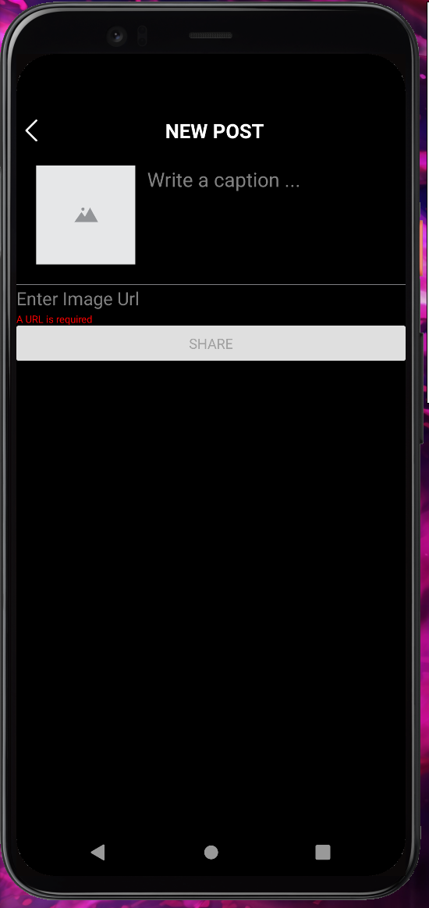

# React Native Project - IG Clone 

  <!-- iOS -->
  
  <!-- Android -->
  
  <!-- Web -->
  

## 🚀 How to use

- Install packages with `yarn`.
- Run `yarn start` to start the bundler.
- Open the project in a React runtime to try it:
  - iOS: [Client iOS](https://itunes.apple.com/app/apple-store/id982107779)
  - Android: [Client Android](https://play.google.com/store/apps/details?id=host.exp.exponent&referrer=blankexample)

- You can sign up by your own or use these credentials
  - email: fake@email.com & password: 123456
  - Firebase free version has been used in this project, if there are any issues logging in or creating an account is due to limited resources.
 

## ✨ Functionalities of the app

- Register an account
- Log in an existing account
- Create public posts
- Like others posts

## 📱 Check Live this project via Expo Go
- Install Expo Go from playstore   
- Install Expo Go from Apple store   
- Open Expo Go and scan the QR Code from the Screenshot below or folow [this link](exp://exp.host/@brisilda-bushi/ig-clone-brisilda?release-channel=default)

## 📱 Screenshots of the final project
### Sign Up Screen

### Sign In Screens

### Home Page Screens

### Add a Post Screens

